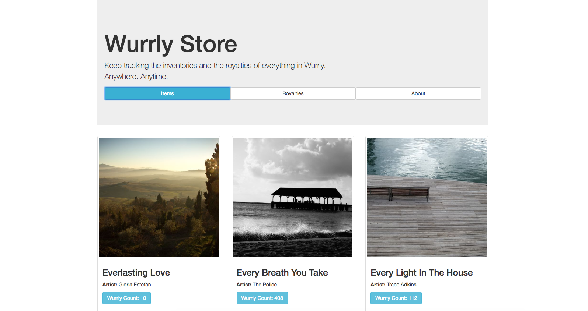
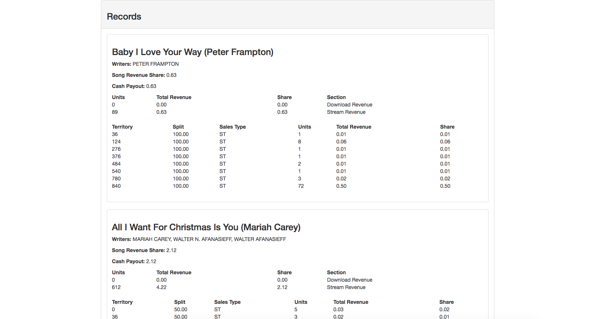

# Wurrly Store

## Overview

This is a single-page React.js app for tracking available items and royalties of Wurrly. Yes, it is single-page, though the browser will play some tricks to resemble a multiple-page one.

### Preview




### Key dependencies

Client-side: `React.js`, `Redux`, `Bootstrap`, `React-router`

Server-side: `Node.js`, `Express.js`

## How to use

To get started, please make sure your device has `Node.js` and `Git` installed, or follow [this link(Node.js)](https://nodejs.org/en/download/), and [this link(git)](https://git-scm.com/book/en/v2/Getting-Started-Installing-Git) to install.

__1.__ Open `command line`, run `git clone https://github.com/akirasunny/wurrly.git` to clone this repository;

__2.__ Navigate to the folder of the repository, run `npm run build` on command line to generate a `bundle.js` in `dist` folder;

__3.__ Run `npm start` or `node server.js` on command line to get Node server started;

__4.__ Open your favorite browser (mine is `Chrome`) and go to `localhost:8080`. Enjoy it!

## App directory structure

```
Wurrly Store
│   README.md
│   server.js
│   package.json
│   ...
│
└───src // React components
│   │   index.js
│   │
│   └───components
│       │   Index.js
│       │   Items.js
│       │   Royalties.js
│       │   ...
│   
└───redux
│   │   Store.js
│   │   Reducer.js
│   │
│   └───reducer
│   │   │   ...
│   └───switch
│       │   ...
│   
└───dist // Entry .html file for React
│   │   index.html
│   │   bundle.js
│   
└───database
└───node_modules
```

## Comments

A very nice exercise that covers most of the basic skills required for React.js and Node.js development. Timing is reasonable as well, if I don't have to work in day time, it's an exercise that can be finished in a relaxed manner.

Also, due to time limitation, I didn't spend too much time in styling, but used Bootstrap to save time instead -- very convenient, and mobile-responsive.

Following are some points I think could be further improved.

__1.__ Royalty records lack their units. For this exercise, it doesn't seem like a problem, but in real world cases, units are absolutely required for accounting;

__2.__ The data structure of royalty records. I noticed that in `records`, two properties `downloadRevenue` and `streamRevenue` have the same pattern, and putting them in the same table will make the record more readable. For this purpose, I would like to put them in an array rather than in two separated properties;

__3.__ In the instruction file, it used a word `scrolling` to describe the way the pagination is possible to be. I at first tried to make an infinite scrolling page to render data, yet it seemed infinite scrollview would tax the browser a lot, especially as the size of dataset grows very large.

Please feel free to reach me out if you have any questions with regard to this app. I look forward to hearing from you soon.

Sunny